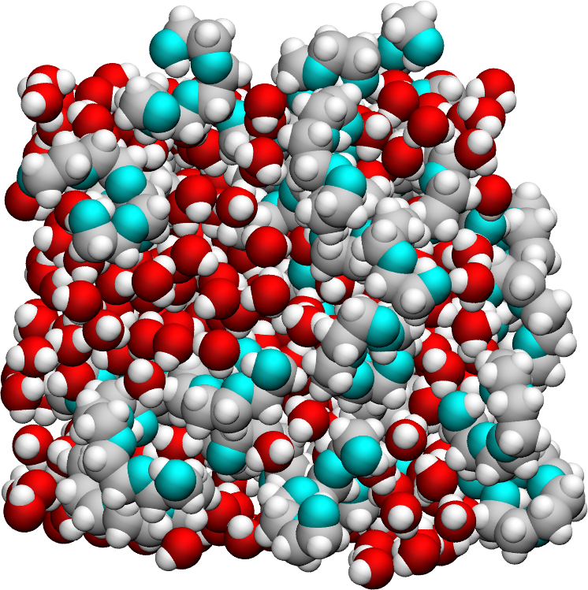

Polymer-Water Mixture Dataset for NMRDfromMD
============================================

<a href="webp">
  
</a>

LAMMPS input files and raw trajectory files used to generate the data
and figure from [nmrdfrommd](https://nmrdfrommd.github.io). The system
consists of a mixture of water a polymer (polyethylene glycol 300, or PEG 300).

## Repository structure

- **[inputs](inputs)**: Contains the LAMMPS input files.
- **[data](data)**: Contains simulation output files (``.data`` and ``.lammpstrj``)
  for various temperatures, generated from the input files. Due to their
  large size, ``.xtc`` files are not hosted in this repository. You can regenerate
  them by relaunching the simulation with LAMMPS.
- **[analysis](analysis)**: Contains Python scripts for running NMRDfromMD
  and extract NMR relaxation rates.
- **[snapshot](snapshot)**: Contains ``.png`` images of the system generated
  using VMD.

## Clone the repository

To clone the repository, run:

```bash
git clone https://github.com/NMRDfromMD/dataset-peg-water-mixture.git
```

To regenerate the trajectory files, navigate to the [data](data) folder:
```bash
cd data
```
Update the path to LAMMPS in ``run.sh`` to reflect your system
configuration:
```bash
lmp=/home/simon/Softwares/lammps-27Jun2024/src/lmp_mpi
```
Then, execute ``run.sh``.

## License

This repository is licensed under the Creative Commons Attribution 4.0
International (**CC BY 4.0**) [License](LICENSE).
